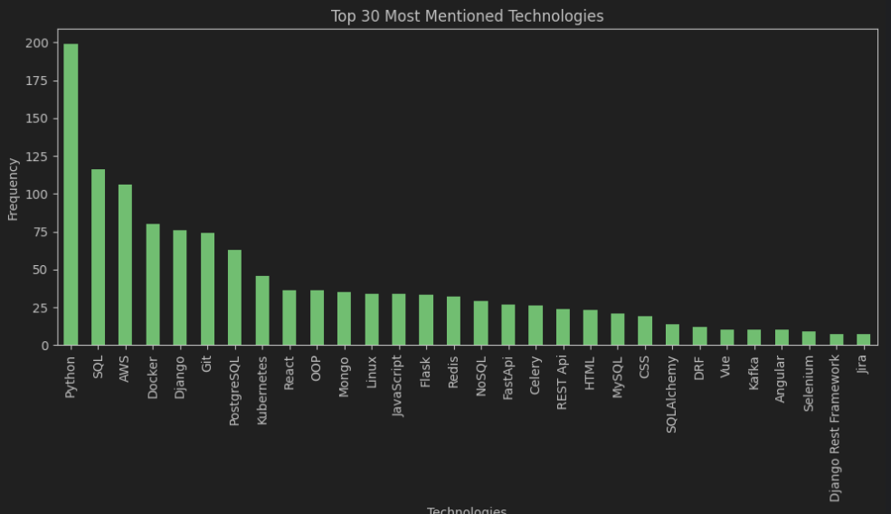
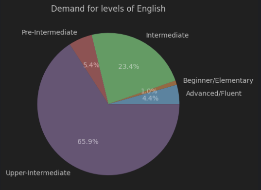

# Djinni vacancy scraping project
A data analysis and web scraping project that shows the most necessary technologies for a Python developer

## Technologies
* Scrapy
* Pandas
* NumPy
* Matplotlib

## Installations

```shell
git clone https://github.com/WonnaKoo/djinni-scrape.git
python3 -m venv venv
source venv/bin/activate  # On Windows use `venv\Scripts\activate`
pip install -r requirements.txt
scrapy crawl djinni -O vacancies.csv
```

Open [analytics file](analitic.ipynb) and run all cells in order (`Ctrl+Alt+Shift+Enter`)

## Example


